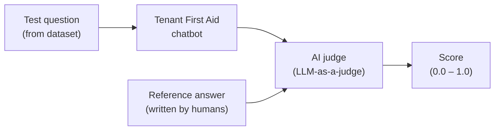
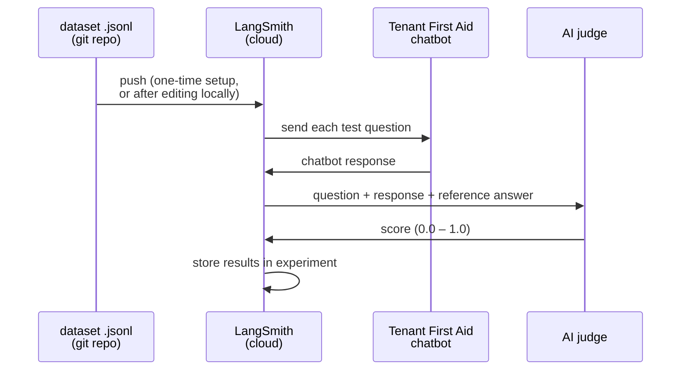
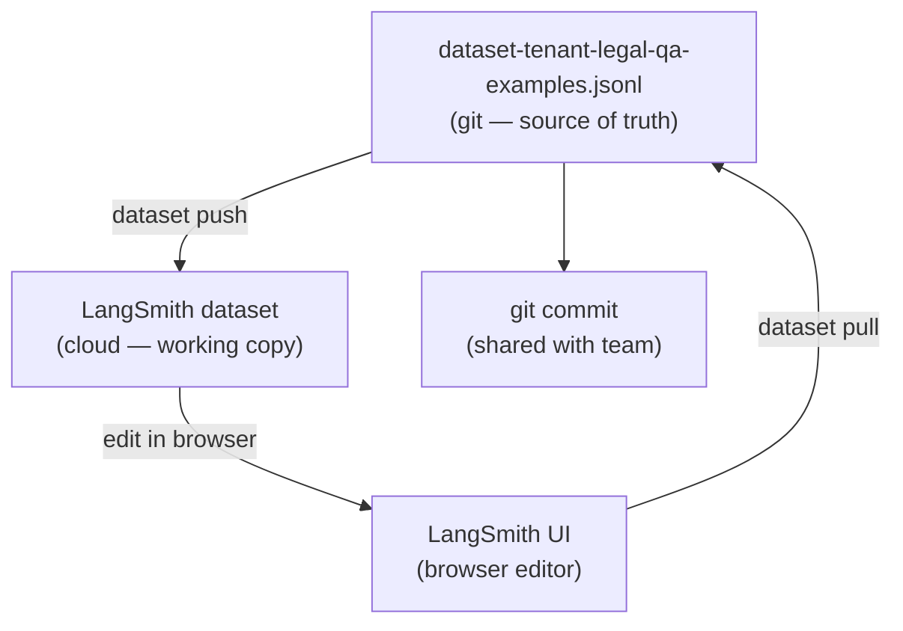
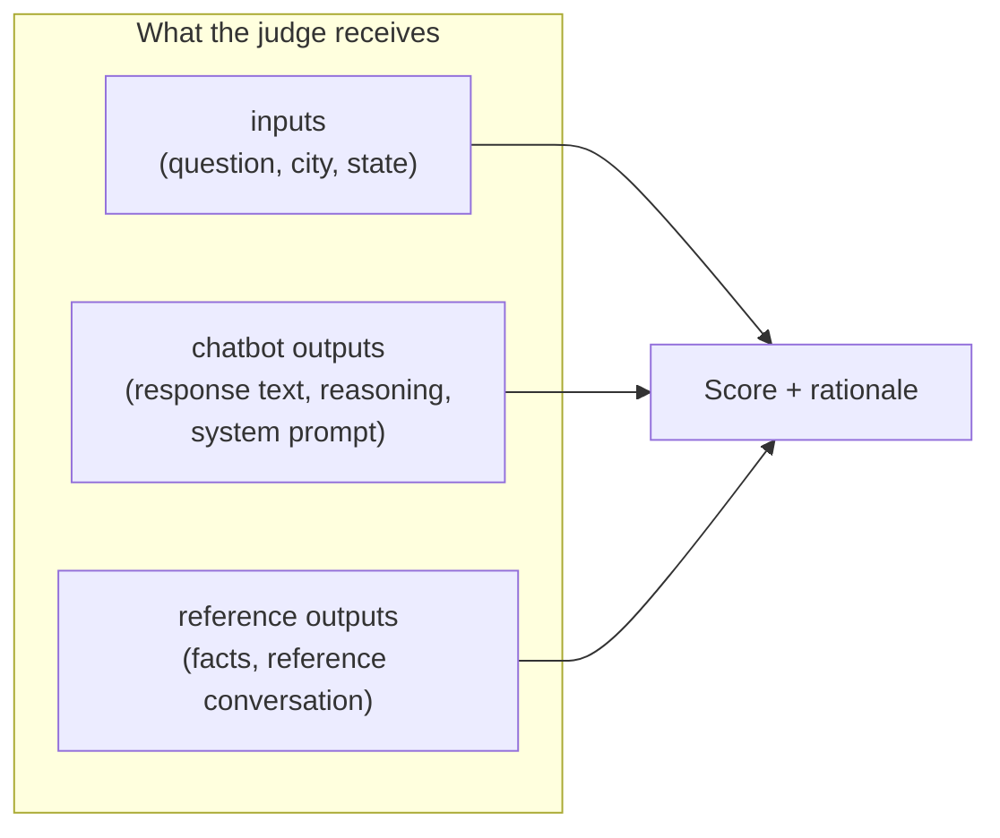
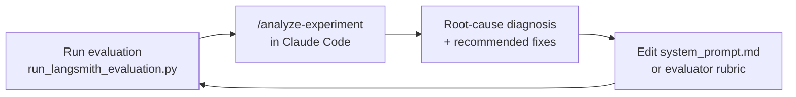
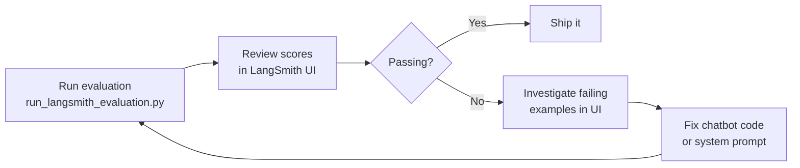
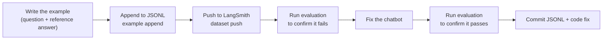
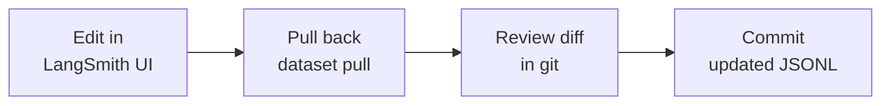
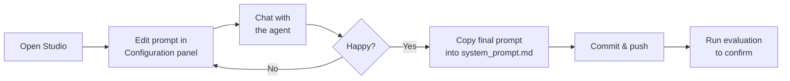
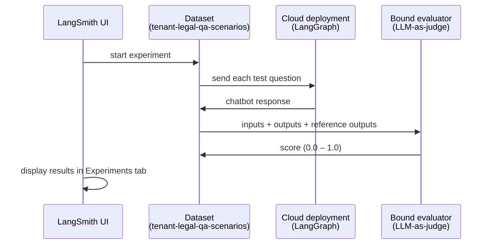

# Automated Evaluation with LangSmith

## What is this and why does it matter?

The chatbot gives legal information to tenants. Getting that information wrong — citing the wrong statute, misstating a deadline, using a dismissive tone — has real consequences for real people. We need a systematic way to check quality, not just hope spot-checks catch problems.

This system runs a suite of test questions through the chatbot automatically, then uses a second AI model ("LLM-as-a-judge") to score the responses against a known-good reference answer. The result is a pass/fail score for each question, surfaced in an online dashboard.

Think of it like a mock client. You hand the chatbot a question you already know the answer to, and measure whether it gets it right.

---

## Definitions

**RAG (Retrieval-Augmented Generation)**
A technique where the AI looks up relevant documents before writing a response, instead of relying solely on what it learned during training. In this project, "retrieval" means searching Oregon housing law texts; "generation" means composing the answer using those passages. This grounds responses in actual statutes rather than the model's general knowledge.

**Agent**
An AI that can do more than answer in one step — it can decide what tools to use, call them, and use the results to compose a final response. Tenant First Aid's chatbot is an agent: when a question comes in, it decides whether to search the legal corpus (the RAG retrieval tool), fetches relevant statutes, and then writes the response.

**System prompt**
A set of instructions given to the agent before any conversation starts. It defines the agent's role, tone, citation style, and legal guardrails ("you are a tenant rights assistant; always cite Oregon statutes; never give legal advice"). The user never sees it. In this codebase it lives in `tenantfirstaid/system_prompt.md`.

**Prompt** (in the context of evaluations)
The text sent to the AI judge telling it how to evaluate a response. Not to be confused with the system prompt above. An evaluator prompt is constructed from the rubric and the example data, and instructs the judge what criteria to apply and what format to return scores in.

**Rubric**
A plain-text document that defines the scoring criteria for one evaluator. It describes what earns a 1.0, 0.5, or 0.0 — for example, a legal correctness rubric says "1.0 = legally accurate; 0.0 = legally wrong or misleading." Rubrics live in `evaluate/evaluators/*.md` so lawyers and non-developers can edit them without touching Python code.

**Evaluator**
A piece of scoring logic that reads the chatbot's response to an example and assigns a score between 0.0 and 1.0. There are two kinds: *LLM-as-judge* evaluators use a second AI model guided by a rubric; *heuristic* evaluators use deterministic code (e.g. checking whether a citation link is well-formed). Each evaluator measures one dimension of quality — legal accuracy, tone, citation format, and so on.

**Example**
One test case. An example contains: the question a tenant asks, city/state context (because tenant law varies by jurisdiction), a reference conversation showing what a correct and well-toned response looks like, and a list of key legal facts the response must get right. Examples are the unit of work the evaluators score.

**Dataset**
The full collection of examples, stored locally in `evaluate/dataset-tenant-legal-qa-examples.jsonl` and uploaded to LangSmith for evaluation runs. The JSONL file in the git repository is the source of truth — the LangSmith copy is a working copy that is synced from it.

**Experiment**
One complete run of the dataset through the chatbot. Each experiment records which version of the code and system prompt was used, the chatbot's response to every example, and the evaluator scores. Experiments are compared side-by-side in the LangSmith UI to measure the impact of a code or prompt change.

**Deployment**
A version of the agent hosted in LangSmith Cloud, defined by `backend/langgraph.json`. A deployment is needed to run experiments from the LangSmith browser UI (so LangSmith can send test questions to a live endpoint) and to use Cloud Studio. Local development uses `langgraph dev` instead of a full deployment.

---



---

## The dataset — the source of truth

The file `dataset-tenant-legal-qa-examples.jsonl` is the authoritative list of test examples. Every example contains:

- **The question** — exactly what a tenant might type
- **Context** — city and state, because tenant law varies by jurisdiction
- **Reference answer** — a human-verified model conversation showing what a correct, well-toned response looks like
- **Key facts** — the legal facts the response must get right

This file lives in the git repository so that all contributors share the same set of test cases. Changes to examples should be committed here, not left only in the cloud.

### What an example looks like

```
inputs:   { "query": "My landlord hasn't fixed my heat for two weeks — what can I do?",
            "city": null, "state": "OR" }

outputs:  { "facts":  ["Landlord has failed to repair heating for 14 days",
                       "ORS 90.365 allows rent reduction after 7 days notice"],
            "reference_conversation": [ {human turn}, {bot turn} ] }
```

---

## How data flows through the system

### Running an evaluation



1. The dataset is uploaded to LangSmith (only needed once, or after changes).
2. LangSmith feeds each test question to the chatbot, one at a time.
3. The chatbot responds just as it would for a real user.
4. LangSmith sends the question, the chatbot's response, and the reference answer to the AI judge.
5. The judge scores the response and LangSmith stores the results.
6. You review scores in the LangSmith dashboard.

### Editing examples and keeping the repo in sync

The LangSmith online editor is the most convenient way to refine a reference answer or reword a test question. But edits made in the browser don't automatically flow back into the git repository. The pull step closes that loop.



**The rule:** anything you change in the browser must be pulled back and committed. The JSONL file is what other contributors see. Run `dataset diff` first to see what changed before overwriting either side.

---

## Setup

1. Sign up for a free account at https://smith.langchain.com/ (Personal workspace is sufficient for running evaluations).
2. Generate an API key from your account settings.
3. Copy `.env.example` to `.env` and fill in the values (see [Environment variables](#environment-variables) for the full list):

```bash
cd backend
cp .env.example .env
# Edit .env with your values
```

---

## Dataset management

All dataset operations go through `langsmith_dataset.py`. Commands below assume you are in the `backend/` directory.

### Initial push (first-time or after local edits)

```bash
uv run langsmith_dataset.py dataset push \
  dataset-tenant-legal-qa-examples.jsonl \
  tenant-legal-qa-scenarios
```

Creates the dataset in LangSmith if it doesn't exist, then uploads all examples.

### Pull after editing in the browser

```bash
uv run langsmith_dataset.py dataset pull \
  tenant-legal-qa-scenarios \
  dataset-tenant-legal-qa-examples.jsonl
```

Overwrites the local file with whatever is currently in LangSmith. Commit the result.

### Validate the local file

```bash
uv run langsmith_dataset.py dataset validate \
  dataset-tenant-legal-qa-examples.jsonl
```

Checks every line against the schema before pushing, catching formatting mistakes early.

### Check for content drift between local and remote

```bash
# Show which examples differ between the local file and LangSmith
uv run langsmith_dataset.py dataset diff \
  dataset-tenant-legal-qa-examples.jsonl \
  tenant-legal-qa-scenarios
```

Reports three categories:

| Symbol | Meaning |
|--------|---------|
| `<` | example exists only on the left (would be lost on a pull, missing on a push) |
| `>` | example exists only on the right |
| `~` | same `scenario_id` on both sides but content differs — shows a field-level unified diff |

Example output:

```
< scenario_id=5
~ scenario_id=12  [content differs]
  --- left/outputs
  +++ right/outputs
  @@ -3,7 +3,7 @@
       "facts": [
  -      "ORS 90.365 allows rent reduction after 7 days notice",
  +      "ORS 90.365 allows rent reduction after 7 days written notice",
         "Landlord must repair within reasonable time"
       ],
> scenario_id=18
```

`dataset diff` is the right first step before pushing or pulling — it tells you exactly what would change. Content changes (`~`) require a human decision: use `example update` to push a local fix to LangSmith, or `dataset pull` followed by `git diff` to review before accepting a remote edit.

---

### Adding examples created in the LangSmith UI

Examples created through the LangSmith browser UI will not have a `scenario_id` in their metadata. The tooling uses `scenario_id` as the stable key for diff, merge, and push operations, so new examples must be assigned one before they can be committed.

1. **Pull** the dataset to get the current state, including any UI-created examples:

   ```bash
   uv run langsmith_dataset.py dataset pull \
     tenant-legal-qa-scenarios \
     dataset-tenant-legal-qa-examples.jsonl
   ```

2. **Identify** the new examples in the JSONL file — they will have `"metadata": null` or a metadata object without a `scenario_id` field.

3. **Assign a `scenario_id`** to each new example. Pick the next available integer (one higher than the current maximum). Also fill in the other required metadata fields (`city`, `state`, `tags`, `dataset_split`) to match the schema. For example:

   ```json
   {
     "metadata": { "scenario_id": 42, "city": null, "state": "OR",
                   "tags": ["city-None", "state-OR"], "dataset_split": ["train"] },
     "inputs": { "query": "...", "city": null, "state": "OR" },
     "outputs": { "facts": [...], "reference_conversation": [...] }
   }
   ```

4. **Validate** the file:

   ```bash
   uv run langsmith_dataset.py dataset validate \
     dataset-tenant-legal-qa-examples.jsonl
   ```

5. **Push** to write the assigned IDs back to LangSmith:

   ```bash
   uv run langsmith_dataset.py dataset push \
     dataset-tenant-legal-qa-examples.jsonl \
     tenant-legal-qa-scenarios
   ```

6. **Commit** the updated JSONL file.

---

### Fine-grained example operations

```bash
# List all examples (shows scenario_id, tags, and the first 80 characters of the question)
uv run langsmith_dataset.py example list tenant-legal-qa-scenarios

# Append new examples from a JSONL file without touching existing ones
uv run langsmith_dataset.py example append \
  tenant-legal-qa-scenarios new-examples.jsonl

# Remove an example by its scenario_id
uv run langsmith_dataset.py example remove \
  tenant-legal-qa-scenarios 42
```

---

## Running evaluations

```bash
cd backend/evaluate

# Run evaluation on the full dataset
uv run run_langsmith_evaluation.py

# Run with a custom experiment label (useful for comparing before/after a change)
uv run run_langsmith_evaluation.py \
  --dataset "tenant-legal-qa-scenarios" \
  --experiment "my-experiment" \
  --num-repetitions 1
```

Results appear in the LangSmith dashboard under your dataset's Experiments tab.

### CI/CD

PRs from forked repos don't have access to repository secrets (including `LANGSMITH_API_KEY`), so evaluations cannot run automatically in CI. Run evaluations locally before submitting a pull request for any change that might affect response quality.

---

## What the scores mean

Each example gets a score between 0.0 and 1.0 for each active evaluator. The overall pass rate is the average across all examples.

### Legal Correctness

Is the legal information accurate under Oregon tenant law?

| Score | Meaning |
|-------|---------|
| 1.0 | Legally accurate |
| 0.5 | Partially correct or missing important nuance |
| 0.0 | Legally wrong or misleading |

### Tone

Is the response appropriately professional, accessible, and empathetic?

| Score | Meaning |
|-------|---------|
| 1.0 | Gets the tone right |
| 0.5 | Too formal, too casual, or inconsistent |
| 0.0 | Dismissive, condescending, or inappropriate |

**Patterns that fail tone evaluation:**
- Opening with "As a legal expert..." (implies the chatbot is giving legal advice, which it isn't)
- Dense legal jargon without plain-language explanation
- Dismissive or condescending phrasing

### Under construction 🚧

These evaluators exist in the code but are disabled pending calibration: citation accuracy, citation format, completeness, tool usage, performance.

---

## How the judge sees each example

When the AI judge scores a response, it receives:



The judge compares what the chatbot actually said against what it should have said, given the same question and context.

---

## Understanding and diagnosing score variance

### Two noise sources

Every score you see in an experiment reflects two independent sources of randomness:

- **Agent variance** — the chatbot gives a slightly different response each time to the same question (LLM temperature > 0). Running the same example ten times will produce ten different outputs, and some will score higher or lower than others.
- **Evaluator variance** — the LLM judge assigns a slightly different score each time it reads the same output. Even a fixed response, shown to the judge five times, may get 1.0 twice and 0.5 three times.

Total observed variance decomposes as:

```
σ²_total = σ²_agent + σ²_evaluator
```

This matters because the two sources call for different fixes: agent variance requires more repetitions per example; evaluator variance requires a better judge or a tighter rubric.

### Measuring evaluator variance

`measure_evaluator_variance.py` isolates evaluator variance by re-scoring the same fixed agent outputs multiple times. No new agent calls are made, so this is cheap (~10–20× cheaper per sample than a full evaluation run).

```bash
# Re-score all runs from an experiment 5 times each (default)
uv run python -m evaluate.measure_evaluator_variance \
  --experiment <experiment-name> \
  --evaluator "legal correctness"

# Use more repeats for a tighter estimate; limit to 3 runs per scenario to keep it fast
uv run python -m evaluate.measure_evaluator_variance \
  --experiment <experiment-name> \
  --evaluator "legal correctness" \
  -k 7 \
  --runs-per-scenario 3
```

Available evaluator names match the `feedback_key` values: `"legal correctness"` and `"appropriate tone"`. Omit `--evaluator` to run all of them.

### Example: interpreting the output

Running the script against a 10-repetition experiment (50 total runs across 5 scenarios) with `-k 5` produced:

```
=== Per-Scenario Consistency ===

Evaluator: legal correctness
  Scenario    mean       σ    0.0    0.5    1.0
  --------  ------  ------  -------------------
  S0          0.77    0.25      0     23     27
  S1          0.87    0.24      1     10     35
  S2          0.48    0.26      8     36      6
  S3          0.93    0.17      0      7     43
  S4          0.66    0.23      0     34     16

=== Evaluator Variance Summary ===
(σ is computed per individual run across k re-evaluations of fixed output)
  legal correctness:
    mean σ = 0.108  (max = 0.400)
```

The consistency table aggregates all scores across the k re-evaluations. The evaluator summary gives the key number: **σ_evaluator = 0.108**.

To decompose variance per scenario, use σ²_agent = σ²_total − σ²_evaluator:

| Scenario | σ_total | σ_evaluator | σ_agent | Evaluator share |
|---|---|---|---|---|
| S0 | 0.25 | 0.108 | 0.22 | 19% |
| S1 | 0.24 | 0.108 | 0.21 | 20% |
| S2 | 0.26 | 0.108 | 0.24 | 17% |
| S3 | 0.17 | 0.108 | 0.13 | 40% |
| S4 | 0.23 | 0.108 | 0.20 | 22% |

**What this tells you:**

- The agent is the dominant noise source (~75–80% of variance for most scenarios). S3 is the exception — the chatbot is highly consistent there, so the judge itself accounts for 40% of variance.
- A `max = 0.400` evaluator σ is a red flag: at least one fixed output received 0.0 and 1.0 on different judge calls. This points to rubric ambiguity on borderline responses. In this data S2 (notice-giving scenario) was the likely culprit — the lowest mean (0.48) and most 0.5 scores indicate the judge is uncertain.

### Decision rules

| Observation | Diagnosis | Fix |
|---|---|---|
| σ_evaluator << σ_total (evaluator share < 15%) | Variance is mostly agent-side | Increase `--num-repetitions` in evaluation runs |
| σ_evaluator ≈ σ_total (evaluator share > 40%) | Judge stochasticity dominates | Use a stronger judge model; tighten the rubric for borderline cases |
| max σ >> mean σ | Some outputs are genuinely borderline | Review judge rationale; add rubric guidance for that failure mode |
| One scenario has much lower σ than the rest | That scenario is well-defined | Good: use it to calibrate expected score ranges |

### Drilling into a specific scenario

Once you identify a noisy scenario, use `--scenario` to focus on it:

```bash
uv run python -m evaluate.measure_evaluator_variance \
  --experiment <experiment-name> \
  --evaluator "legal correctness" \
  --scenario 2
```

Multiple scenario IDs are accepted: `--scenario 2 4`.

### Improving the rubric for borderline cases

If max σ is high (> 0.3) for a scenario, the most likely cause is rubric ambiguity on borderline responses — the judge is uncertain what the 0.5 vs 1.0 threshold means for that type of question.

Steps:
1. Run `--scenario <id> -k 7` to collect enough data to see the pattern.
2. Look at the score distribution: lots of 0.5 scores with some 0.0 and 1.0 suggests the judge is genuinely unsure. Many swings between 0.0 and 1.0 on the same output suggests the rubric doesn't distinguish those cases.
3. Edit `evaluate/evaluators/legal_correctness.md` — add a concrete example of the borderline case and specify which tier it should fall in.
4. Re-run the script against the same experiment to confirm σ drops.

The rubric lives in a plain markdown file — no code change needed. See [Editing evaluator rubrics](#editing-evaluator-rubrics) for the file locations.

### Sample size guidance

With σ_agent ≈ 0.20 (typical for this dataset), the 95% confidence interval on a scenario mean is approximately:

| Repetitions per scenario | 95% CI width |
|---|---|
| 10 | ± 0.12 |
| 25 | ± 0.08 |
| 35 | ± 0.07 |
| 50 | ± 0.06 |

**To detect a 0.10-point improvement with 80% power** at this σ_agent, you need ~32 repetitions per scenario. Ten repetitions (the default) is sufficient for spotting large regressions but too noisy to confirm incremental gains.

---

## Viewing and comparing results

Open https://smith.langchain.com/ → your dataset → **Experiments** tab.

From there you can:
- See per-example scores and the judge's written rationale for each score
- Compare two experiments side-by-side to measure the impact of a code change
- Filter to failing examples to understand where the chatbot struggles

To compare two experiments from the command line:

```bash
uv run python evaluate/langsmith_dataset.py experiment compare \
  tfa-baseline tfa-my-experiment
```

---

## Claude-assisted analysis with `/analyze-experiment`

The `/analyze-experiment` skill is a Claude Code command that automates the full experiment investigation workflow — from aggregate scores through root-cause diagnosis — in a single step.

Invoke it from any Claude Code session in this repository:

```
/analyze-experiment <experiment-name-or-uuid>
```

For example:

```
/analyze-experiment tfa-2026-04-13
/analyze-experiment c663e09e-1234-...
```

### What it does

Claude runs the following automatically and synthesizes the findings:

1. **Overview** — `experiment show` and `experiment stats` in parallel to get aggregate scores and per-scenario consistency tables. Identifies scenarios with low means or high variance.

2. **Exemplar selection** — For the worst-performing scenario, fetches all runs sorted worst-to-best and selects one 0.0 run and one 1.0 run from the same scenario. This controls for question difficulty — any difference between them is a signal about agent behaviour, not input variation.

3. **Trace analysis** — Reads the full execution trace for both exemplars, including tool calls, retrieved passages, and the final model output. Looks for which of the following failure modes is present:

   | Failure mode | Signature |
   |---|---|
   | **Retrieval miss** | The correct statutory text is absent from retrieved passages in both runs; the 1.0 run succeeded on general knowledge rather than retrieval |
   | **Query too broad** | The RAG query echoes the user's words verbatim; specific statute language is absent from results |
   | **Reasoning failure** | The correct text was retrieved but the model ignored or misapplied it |
   | **Instruction conflict** | Two system-prompt rules contradict each other; the model follows one and suppresses the other. Hard signature: empty `content` field with reasoning tokens but no tool calls |
   | **Confabulation** | The model asserted specific numbers, dates, or rules not present in retrieved text or system prompt |
   | **Misleading retrieval** | Retrieved passages are technically accurate but framed in a way that leads to a wrong inference |

4. **Recommended fixes** — Matched to the failure mode:

   | Failure mode | Fix |
   |---|---|
   | Retrieval miss | Corpus update needed; names the missing statute |
   | Query too broad | Better RAG query formulation or updated tool description |
   | Reasoning failure | System-prompt guidance targeting that reasoning step |
   | Instruction conflict | Identifies the conflicting lines; suggests a carve-out or clarified precedence |
   | Confabulation | Tighter anti-hallucination instruction |
   | Misleading retrieval | System-prompt trigger to search for the protective statute before drawing conclusions |

### Output format

Results are presented as: overview table → worst-scenario highlights → root-cause diagnosis → recommended fixes.

### Comparing two experiments

If you have a baseline experiment to compare against, include it:

```
/analyze-experiment <baseline> <experiment>
```

Claude will run `experiment compare` in parallel with the overview and highlight which scenarios improved, regressed, or remained unchanged.

### When to use this vs. the LangSmith UI

The LangSmith UI is best for browsing individual scores and reading judge rationale for specific examples. The `/analyze-experiment` skill is best when you want a diagnosis — not just the numbers, but a hypothesis about *why* a scenario is failing and what to change.

A typical workflow after running a new experiment:



---

## Typical workflows

### "I want to check quality before a release"



### "I found a chatbot mistake and want to add a test for it"



### "I want to improve a reference answer using the browser editor"



---

## Environment variables

The agent needs the same set of variables regardless of where it runs. How you provide them differs between local development and Cloud deployment.

### Variable reference

| Variable | Required | Example | Description |
|---|---|---|---|
| `MODEL_NAME` | yes | `gemini-2.5-pro` | LLM model name |
| `GOOGLE_CLOUD_PROJECT` | yes | `tenantfirstaid` | GCP project ID |
| `GOOGLE_CLOUD_LOCATION` | yes | `global` | Vertex AI location |
| `GOOGLE_APPLICATION_CREDENTIALS` | yes | *(see below)* | GCP credentials — file path locally, inline JSON in Cloud |
| `VERTEX_AI_DATASTORE_LAWS` | yes | `city-state-law-data-2025-edition_...` | Vertex AI Search datastore ID for the Oregon laws corpus |
| `LANGSMITH_API_KEY` | for evals | `lsv2_pt_...` | LangSmith API key (not needed for `langgraph dev` itself) |
| `LANGSMITH_TRACING` | no | `true` | Enable LangSmith tracing |
| `LANGCHAIN_TRACING_V2` | no | `true` | Enable detailed tracing |
| `LANGSMITH_PROJECT` | no | `tenant-first-aid-dev` | LangSmith project name for traces |
| `SHOW_MODEL_THINKING` | no | `false` | Capture Gemini reasoning in responses |

### Local development (`langgraph dev` and evaluations)

All variables go in `backend/.env`. Copy `.env.example` and fill in the values:

```bash
cp .env.example .env
```

`GOOGLE_APPLICATION_CREDENTIALS` is the **file path** to your GCP credentials JSON, typically `~/.config/gcloud/application_default_credentials.json`. See the project README for how to set up GCP credentials locally.

### LangSmith Cloud deployment

Cloud deployments don't use a `.env` file. Instead, environment variables are configured in the LangSmith UI.

**Setting up the GCP credential as a workspace secret:**

`GOOGLE_APPLICATION_CREDENTIALS` contains sensitive service account JSON. To avoid exposing it in the deployment settings (which are viewable by all workspace members):

1. Go to **LangSmith → Settings → Workspace Secrets**.
2. Create a secret named `GOOGLE_APPLICATION_CREDENTIALS` with the full JSON content of the service account key file (paste the raw JSON, not a file path).
3. Save.

**Configuring the deployment's environment:**

1. Go to **Deployments → your deployment → Settings → Environment Variables**.
2. Add each variable. For most, paste the value directly:

   | Key | Value |
   |---|---|
   | `MODEL_NAME` | `gemini-2.5-pro` |
   | `GOOGLE_CLOUD_PROJECT` | `tenantfirstaid` |
   | `GOOGLE_CLOUD_LOCATION` | `global` |
   | `VERTEX_AI_DATASTORE_LAWS` | `city-state-law-data-2025-edition_...` |
   | `SHOW_MODEL_THINKING` | `false` |

3. For the credential, reference the workspace secret instead of pasting the value:

   | Key | Value |
   |---|---|
   | `GOOGLE_APPLICATION_CREDENTIALS` | `{{GOOGLE_APPLICATION_CREDENTIALS}}` |

   The `{{...}}` syntax tells LangSmith to resolve the value from the workspace secret at runtime. If you later rotate the credential, update the workspace secret — no redeployment needed.

4. Save and redeploy.

`LANGSMITH_API_KEY` is **not** needed in the deployment environment — the Cloud runtime provides it automatically.

---

## Troubleshooting

### "Dataset not found"

The dataset hasn't been pushed yet. Run:
```bash
uv run langsmith_dataset.py dataset push \
  dataset-tenant-legal-qa-examples.jsonl \
  tenant-legal-qa-scenarios
```

### Scores seem wrong or inconsistent

LLM-as-judge has its own biases and can be inconsistent on borderline cases. Review the judge's written rationale for specific failing examples in the LangSmith UI, then refine the evaluator rubrics in `evaluators/*.md` if the scoring logic is the problem (see [Editing evaluator rubrics](#editing-evaluator-rubrics) below).

### Evaluation is too slow

Pass `--max-concurrency 3` (or higher) to run multiple examples in parallel, or temporarily reduce the dataset size in LangSmith to evaluate a representative subset.

## Editing the system prompt

The chatbot's system prompt lives in `tenantfirstaid/system_prompt.md`. This is a plain-text markdown file that anyone can edit — no Python knowledge required. It controls the chatbot's personality, tone, citation style, and legal guardrails.

The file uses two placeholders that are substituted at runtime:
- `{RESPONSE_WORD_LIMIT}` — currently 350
- `{OREGON_LAW_CENTER_PHONE_NUMBER}` — currently 888-585-9638

Everything else is literal text. **Do not** add other `{...}` placeholders — Python's `str.format()` will break on stray curly braces.

### Iterating on the system prompt in Studio

You don't have to commit every tweak to test it. LangGraph Studio (available via Cloud deployment or `langgraph dev`) exposes the system prompt in a **:gear: Manage Assistants** panel next to the chat window. The full prompt from `system_prompt.md` is pre-populated as the default — you just edit in place and chat.



Step by step:

1. **Open Studio.** Either open LangSmith Cloud → Deployments → your deployment → Studio, or run `langgraph dev` locally and open `http://localhost:2024`.
2. **Find the Configuration panel.** It's in the sidebar or top bar, depending on your Studio version. You'll see a text field labeled **system_prompt** with the full current prompt.
3. **Edit the prompt.** Change whatever you want — rephrase a rule, add a guideline, adjust the tone. The edit applies immediately to the next message you send.
4. **Chat with the agent.** Send a test question and see how the agent responds with your updated prompt. Try several questions to check different behaviors.
5. **Iterate.** Tweak the prompt again, send another question. Repeat until you're satisfied. Each conversation thread remembers your config, so you can go back and compare.
6. **Save your work.** Once you have wording you like, copy the prompt text from the Configuration panel and paste it into `tenantfirstaid/system_prompt.md` (remember to keep the `{RESPONSE_WORD_LIMIT}` and `{OREGON_LAW_CENTER_PHONE_NUMBER}` placeholders). Commit and push.
7. **Run an evaluation** to verify the change didn't break anything across the full example suite.

The Configuration panel is per-conversation — resetting it or starting a new thread reverts to the default from `system_prompt.md`. Your changes aren't permanent until you commit the file.

---

## Editing evaluator rubrics

LLM-as-judge evaluators (legal correctness, tone, citation accuracy) use scoring rubrics stored as markdown files in `evaluators/`:

```
evaluators/
  legal_correctness.md
  tone.md
  citation_accuracy.md
```

Each file describes what a good answer looks like and the scoring guidelines (1.0 / 0.5 / 0.0). The Python code in `langsmith_evaluators.py` loads these files and wraps them in the structural boilerplate the AI judge needs.

To refine how the judge scores responses, edit the rubric file and commit. You can also experiment with rubric wording in the LangSmith UI by binding an LLM-as-judge evaluator to your dataset — when you find wording you like, copy it back into the `.md` file and commit so everyone shares the same criteria.

### Testing rubric changes without re-running the agent

After editing a rubric, use `measure_evaluator_variance.py` to re-score an existing experiment's outputs with the new rubric — no new agent calls needed. Pass `--show-delta` to see how the updated rubric changed scores compared to what was originally recorded in the experiment. Evaluator calls run concurrently; use `--max-workers` to control parallelism (default: 10).

```bash
# Re-score all runs and show per-scenario deltas vs. stored scores
uv run python -m evaluate.measure_evaluator_variance \
  --experiment <experiment-name> \
  --evaluator "legal correctness" \
  --show-delta \
  -k 5

# Focus on a specific scenario; increase workers for a large experiment
uv run python -m evaluate.measure_evaluator_variance \
  --experiment <experiment-name> \
  --evaluator "legal correctness" \
  --scenario 2 \
  --show-delta \
  --max-workers 20 \
  -k 5
```

With `--show-delta`, the mean and σ columns in the Per-Scenario Consistency table show the new value with the change from the stored score in parentheses:

```
=== Per-Scenario Consistency ===

Evaluator: legal correctness
  Scenario        mean           σ    0.0    0.5    1.0
  --------  ----------  ----------  -----  -----  -----
  S0        0.95(+0.23)  0.05(-0.13)    0      2      8
  S1        0.80(+0.30)  0.12(-0.23)    1      1      8
  S2        0.45(+0.05)  0.24(-0.02)    3      5      2
```

A positive delta on mean means the rubric change raised scores for that scenario; a negative delta on σ means scoring became more consistent. Use `-k 1` for a quick sanity check and `-k 5` or higher to confirm that evaluator σ has genuinely dropped.

Heuristic evaluators (citation format, tool usage, performance) are Python code in `langsmith_evaluators.py` and require a developer to modify.

---

## Bound evaluators (running evaluations from the LangSmith UI)

Instead of running `run_langsmith_evaluation.py` locally, you can bind an LLM-as-judge evaluator directly to the dataset in LangSmith and run experiments from the browser against your Cloud deployment. This is useful for non-developers who want to iterate on the system prompt or test examples without a local Python setup.

### How it works



### Prerequisites

- A LangSmith **Plus-tier** seat (bound evaluators are not available on the free tier).
- The dataset `tenant-legal-qa-scenarios` already pushed to LangSmith (see [Dataset management](#dataset-management)).
- A working Cloud deployment of the agent (see [Testing the agent with LangGraph Studio → Option A](#option-a-langsmith-cloud-plus-tier-seat-holders)).

### Setting up a bound evaluator (example: Legal Correctness)

1. Go to **LangSmith → Datasets → `tenant-legal-qa-scenarios`**.
2. Open the **Evaluators** tab and click **+ Add Evaluator**.
3. Choose **LLM-as-Judge**.

#### Prompt

Choose **Create your own prompt** and paste the contents of `evaluators/legal_correctness.md` wrapped in the boilerplate from `langsmith_evaluators.py:load_rubric`. Three placeholder variables — `{inputs}`, `{outputs}`, `{reference_outputs}` — are populated automatically by LangSmith from the dataset example and the deployment's response.

**Prompt commits.** Every time you save or edit the prompt, LangSmith creates a new commit with a unique hash, giving you a version history you can browse and revert.

#### Model configuration

Select the model the judge will use. To match the offline evaluator, use:

| Setting | Value | Notes |
|---|---|---|
| **Provider** | `Cloud providers: Google Vertex AI` | Routes judge calls through Vertex AI using the workspace provider secret. |
| **API Key Name** | `GOOGLE_VERTEX_AI_WEB_CREDENTIALS` | The provider secret defined in **Settings → Workspace → Integrations → Provider secrets**. This is the same service account credential as `GOOGLE_APPLICATION_CREDENTIALS`, registered under the name LangSmith expects for Vertex AI. |
| **Model** | `gemini-2.5-flash` | Matches `EVALUATOR_MODEL_NAME` in `langsmith_evaluators.py`. |
| **Temperature** | `0.0` | Lower temperature = more deterministic scoring. The offline `openevals` evaluator defaults to `0.0`. |

#### Feedback configuration

Feedback configuration defines the scoring rubric the judge outputs. Scores are attached as feedback to each run in the experiment.

| Setting | Value | Notes |
|---|---|---|
| **Feedback key** | `legal correctness` | The name shown in experiment results. Use the same key as the offline evaluator so scores are comparable across UI and CLI experiments. |
| **Description** | `Is the legal information accurate under Oregon tenant law?` | Optional but helpful for collaborators. |
| **Feedback type** | **Continuous** | Numerical score within a range. The other options are **Boolean** (true/false) and **Categorical** (predefined labels). |
| **Range** | `0.0` – `1.0` | Matches the offline evaluator's three-level scale (0.0 / 0.5 / 1.0). |

LangSmith adds the feedback configuration as structured output instructions to the judge prompt behind the scenes, so the model knows what format to return.

#### Save

Click **Save**. The evaluator is now bound to the dataset and will automatically run on any new experiment created against this dataset — whether started from the UI or from the SDK.

#### Adding the tone evaluator

Repeat the steps above using the rubric from `evaluators/tone.md`, feedback key `appropriate tone`, and the same prompt template structure.

### Running an experiment from the UI

1. Go to the dataset's **Experiments** tab.
2. Click **+ New Experiment**.
3. Select your **Cloud deployment** as the target.
4. Run. LangSmith sends each dataset example to the deployment, collects responses, and scores them with the bound evaluator automatically.

Results appear in the same Experiments view used by the offline CLI, with the same feedback keys, so scores are directly comparable.

**Limitation:** the UI runs each example exactly once. The `--num-repetitions` option (useful for measuring scoring variance across runs) is only available through the CLI:

```bash
uv run run_langsmith_evaluation.py --num-repetitions 3
```

#### How the deployment accepts dataset inputs

The dataset stores examples as `query/state/city`, but the underlying agent expects a `messages` list. The deployment graph has an adapter node that converts `query` to a `HumanMessage` before the agent runs, so dataset examples are sent directly to the deployment without any transformation on the LangSmith side. The deployment's input schema (`_DeploymentInput` in `graph.py`) declares `query` and `state` as required and `city` as optional, matching the dataset format.

### Keeping bound evaluators in sync with the codebase

There is no API to update a bound evaluator prompt programmatically. When you edit a rubric in `evaluators/`, update the bound evaluator prompt manually in the LangSmith UI (Datasets → `tenant-legal-qa-scenarios` → Evaluators → edit the evaluator).

If a lawyer edits the rubric wording in the LangSmith Playground, pull the changes back to the local files. First check what changed with a dry run:

First, find the prompt name:

```bash
uv run langsmith_dataset.py prompt list
```

Then dry-run to review the diff:

```bash
uv run langsmith_dataset.py prompt pull tfa-legal-correctness evaluators/legal_correctness.md --dry-run
```

Then write and commit:

```bash
uv run langsmith_dataset.py prompt pull tfa-legal-correctness evaluators/legal_correctness.md
git add evaluate/evaluators/legal_correctness.md
git commit -m "update legal correctness rubric from Prompt Hub"
```

This only works if the prompt uses `<Rubric>…</Rubric>` tags around the rubric text.

### Cost

Bound evaluators use your GCP service account (`GOOGLE_VERTEX_AI_WEB_CREDENTIALS`) to call the judge model on Vertex AI. Judge model calls are billed to your Google Cloud account, not your LangSmith plan.

---

## Testing the agent with LangGraph Studio

Studio lets you chat with the full agent — tools, RAG retrieval, and all — in an interactive UI. There are two ways to access it depending on your setup.

### Option A: LangSmith Cloud (Plus-tier seat holders)

No local setup needed. Go to LangSmith → Deployments → your deployment → **Studio**. The agent is deployed from the `langgraph.json` manifest in `backend/`, and environment variables are configured in the deployment settings (see [Environment variables → LangSmith Cloud deployment](#langsmith-cloud-deployment) above).

Cloud deployment also enables:
- **Bound evaluators**: LLM-as-judge evaluators configured in the UI that auto-run on new experiments
- **Experiment comparison**: side-by-side scoring across prompt or code changes

### Option B: Local dev server (no LangSmith account required)

For contributors without a Plus-tier seat, `langgraph dev` runs the same agent locally.

```bash
cd backend
uv run langgraph dev [--no-browser]
```

This starts a local server on `http://localhost:2024` with an interactive Studio UI. You can chat with the agent, see tool calls and RAG results, inspect the graph execution step by step, and use the Configuration panel to iterate on the system prompt — the same workflow as Cloud Studio.

Requires `langgraph-cli[inmem]` (already in dev dependencies) and GCP credentials in your local `.env`.

**NOTE**: Safari blocks the `http` redirect, so use Vivaldi/Chrome (`--no-browser` runs without automatically opening up your default browser ... navigate to the `Studio UI` URL)

---

## Roadmap

- [x] demonstrate basic evaluation flow (CLI-only) on single-turn examples
- [x] use LangSmith web UI to view experimental results
- [x] capture more info in LangSmith experimental results to enable debugging (aka LLM psycho-analysis)
- [x] externalize system prompt to editable markdown file
- [x] externalize evaluator rubrics to editable markdown files
- [x] LangGraph entry point for `langgraph dev` and Cloud deployment
- [x] configurable system prompt in LangGraph Studio (no redeploy needed to iterate)
- [ ] enable additional evaluators (e.g. citation correctness)
- [ ] enable LangSmith web UI to edit examples
  - [ ] update facts in existing examples to enable additional/better evaluators (e.g. citation correctness)
- [x] enable LangSmith web UI to edit evaluators via bound evaluators
- [x] enable LangSmith web UI to launch experiments via Cloud deployment
- [ ] demonstrate evaluation of multi-turn examples
- [ ] A/B testing of system prompt variants
